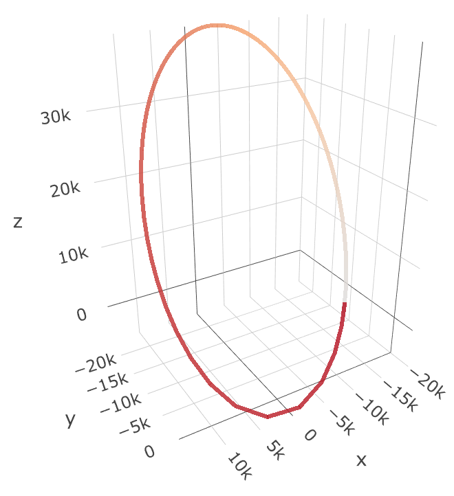

```{r setup, echo=FALSE}
knitr::opts_chunk$set(message=FALSE, fig.path='figures/')
hasData <- requireNamespace("asteRiskData", quietly = TRUE)
if (!hasData) {                                                                     
  evaluateExtraChunks <- FALSE                                             
  msg <- strwrap("Note: some examples in this vignette require that the
                 `asteRiskData` package be installed. The system
                  currently running this vignette does not have that package
                  installed, so code examples will not be evaluated.")
  msg <- paste(msg, collapse="\n")
  message(msg)                                                                    
} else {
  evaluateExtraChunks <- TRUE
  library(asteRiskData)
}
```

<!-- Title block -->
<br>
<p style="text-align:center;font-size:200%;color:Red"> asteRisk </p>
<p style="text-align:center;font-size:90%;color:Gray"> Rafael Ayala,
Daniel Ayala, Lara Sellés Vidal </p>
<p style="text-align:center;font-size:90%;color:Gray"> March 21, 2021 </p>
<br>

# Introduction

Unlike positional information of planes and other aircrafts, satellite positions
is not readily available for any timepoint along its orbit. Instead, orbital 
state vectors at discrete and relatively scarce (compared to, for example, the
large information density available for aircrafts) timepoints and generated from 
multiple observations are generated by entities with access to such information,
such as the United States Space Surveillance Network. Unclassified information
can be obtained through resources such as [Space-Track](https://www.space-track.org)
and [CelesTrak](https://celestrak.org), most commonly in the form of TLE (Two/Three
Line Elements).

However, due to the periodicity of the trajectories (orbits) followed by 
satellites, if the state vector of an object orbiting Earth is known at a given
time, it is possible to predict their state vectors at future or past times.
In order to accurately perform such predictions, known as orbit propagation,
it is necessary to use complex models that take into consideration not only the 
gravitational attraction of Earth, but also atmospheric drag and secular and 
periodic perturbations of the Moon and the Sun, among other effects.

The most widely applied models are the SGP4 and SDP4 models, whose first
implementations were introduced in FORTRAN IV in 1988. <b>asteRisk</b> aims
to constitute the basis for astrodynamics analysis in R. To that extent, it 
provides a native R implementation of the SGP4 and SDP4 models and utilities to
parse and read TLE files and to convert coordinates between different reference
frames. Additionally, a high-precision orbital propagator is also provided.
High-precision propagators model a set of forces that act on satellites to
calculate the resulting acceleration, and propagate the orbit by numerically
solving the resulting differential equation for the position. 

# Installation instructions

Before installing <b>asteRisk</b>, make sure you have the latest version of R
installed. To install <b>asteRisk</b>, start R and enter:

```{r tidy = TRUE, eval = FALSE}
install.packages("asteRisk")
```

Once installed, the package can be loaded as shown below:

```{r tidy = TRUE, eval = TRUE}
library(asteRisk)
```

# Reading TLE and RINEX files

TLE (Two-/Three- Line Element) is the standard format for representing orbital
state vectors. In short, TLEs have 2 lines that contain the orbital parameters
that characterize the state of a satellite at a given time, known as epoch. An
additional initial line can be present to indicate the name of the satellite.
A detailed description of the TLE format can be found [here](https://celestrak.org/columns/v04n03/#FAQ01).

<b>asteRisk</b> provides the utilities to read TLE files (function <b>readTLE()</b>), 
and to directly parse character vectors containing the lines of a TLE as strings
(function <b>parseTLElines()</b>). The resulting lists contain the NORAD catalog
number of the satellite, the classification level of the information, its 
international designator, launch year, launch number, launch piece, the date
and time of the state vector, the orbital parameters (angular speed, 
eccentricity, inclination, argument of the perigee, longitude of the ascending 
node, anomaly) and the drag coefficient of the satellite.

A file with a set of 29 TLE, provided in
[Revisiting Space Track Report #3](http://www.celestrak.org/publications/aiaa/2006-6753/AIAA-2006-6753.pdf) and
typically used to benchmark implementations of the SGP4/SDP4 propagators, is
distributed with <b>asteRisk</b>, in file named testTLE.txt:

```{r tidy = TRUE}
# Read the provided file with 29 benchmark TLE, which contains objects with
# a variety of orbital parameters

test_TLEs <- readTLE(paste0(path.package("asteRisk"), "/testTLE.txt"))
# TLE number 17 contains a state vectors for Italsat 2
test_TLEs[[17]]

# It is also possible to directly parse a character vector with 2 or 3 elements,
# where each element is a string representing a line of the TLE, to obtain the
# same result:
italsat2_lines <- c("ITALSAT 2",
"1 24208U 96044A   06177.04061740 -.00000094  00000-0  10000-3 0  1600",
"2 24208   3.8536  80.0121 0026640 311.0977  48.3000  1.00778054 36119")

italsat2_TLE <- parseTLElines(italsat2_lines)
italsat2_TLE

test_TLEs[[17]]$inclination == italsat2_TLE$inclination
```

RINEX (Receiver Independent Exchange Format), on the other hand, is one of the 
most widely used formats for providing data of global satellite navigation 
systems (GNSS). The RINEX standard defines several file types, among which 
navigation files are used to distribute positional information of the 
satellites. While the format is mainly limited for GNSS, it is of interest
for satellite positioning applications given the large amounts of publicly
available, high-precision data for such satellite constellations.

The exact information provided in a RINEX navigation file varies for each GNSS.
For example, while GLONASS navigation files provide directly the position,
velocity and acceleration in the GCRF frame of coordinates, GPS navigation
files provide orbital elements.

<b>asteRisk</b> provides functions to read RINEX navigation files for GPS and
GLONASS satellites (functions <b>readGPSNavigationRINEX()</b> and 
<b>readGLONASSNavigationRINEX()</b> respectively):

```{r tidy = TRUE}
# Read the provided test RINEX navigation files for both GPS and GLONASS:

testGPSnav <- readGPSNavigationRINEX(paste0(path.package("asteRisk"), 
"/testGPSRINEX.txt"))
testGLONASSnav <- readGLONASSNavigationRINEX(paste0(path.package("asteRisk"), 
"/testGLONASSRINEX.txt"))

# Count the number of positional messages in each file:

length(testGPSnav$messages)
length(testGLONASSnav$messages)
```

# Propagation of orbits

The two orbit propagators currently available in <b>asteRisk</b> are the SGP4
and SDP4 models. They allow the calculation of the position and velocity of the 
satellite at different times, both before and after the time corresponding to 
the known state vector (referred to as "epoch"). Kepler's equation is solved 
through fixed-point integration. It should be noted that the SGP4 model can only 
accurately propagate the orbit of objects near Earth (with an orbital period 
shorter than 225 minutes, corresponding approximately to an altitude lower than 
5877.5 km). 

For propagation of objects in deep space (with orbital periods 
larger than 225 minutes, corresponding to altitudes higher than 5877.5 km), the
SDP4 model should be used, which contains additions to take into account the 
secular and periodic perturbations of the Moon and the Sun on the orbit of the 
satellite. It also considers Earth resonance effects on 24-hour geostationary 
and 12-hour Molniya orbits. 

However, it should be noted that SDP4 employs only simplified drag equations, 
and lacks corrections for low-perigee orbits. Therefore, it is recommended to 
apply the standard SGP4 model for satellites that are not in deep space. 

<b>asteRisk</b> provides three functions to apply the SGP4/SDP4 propagators.
The <b>sgdp4()</b> function automatically determines if the satellite is in 
deep space or near Earth, and applies the appropriate model. The application of
either SGP4 or SDP4 can be forced with the <b>sgp4()</b> and <b>sdp4()</b>
functions respectively. However, it is not recommended to apply SGP4 to objects 
in deep space or SDP4 to objects near Earth. In the following example, we
calculate and visualize the trajectory of a satellite with a high-eccentricity
Molniya orbit:

```{r tidy = TRUE}
# Element 11 of the set of test TLE contains an orbital state vector for
# satellite MOLNIYA 1-83, launched from the USSR in 1992 and decayed in 2007

molniya <- test_TLEs[[11]]
1/molniya$meanMotion

# From the inverse of the mean motion, we can see that the orbital period is 
# approximately half a day, in accordance with a Molniya orbit
# Let´s use the SDP4 model to calculate the position and velocity of the
# satellite for a full orbital period every 10 minutes. It is important to
# provide the mean motion in radians/min, the inclination, anomaly, 
# argument of perigee and longitude of the ascending node in radians, and
# the target time as an increment in minutes for the epoch time

targetTimes <- seq(0, 720, by=10)

results_position_matrix <- matrix(nrow=length(targetTimes), ncol=3)
results_velocity_matrix <- matrix(nrow=length(targetTimes), ncol=3)

for(i in 1:length(targetTimes)) {
    new_result <- sgdp4(n0=molniya$meanMotion*((2*pi)/(1440)),
                        e0=molniya$eccentricity,
                        i0=molniya$inclination*pi/180,
                        M0=molniya$meanAnomaly*pi/180,
                        omega0=molniya$perigeeArgument*pi/180,
                        OMEGA0=molniya$ascension*pi/180,
                        Bstar=molniya$Bstar,
                        initialDateTime=molniya$dateTime, targetTime = targetTimes[i])
    results_position_matrix[i,] <- new_result[[1]]
    results_velocity_matrix[i,] <- new_result[[2]]
}
last_molniya_propagation <- new_result
results_position_matrix = cbind(results_position_matrix, targetTimes)
colnames(results_position_matrix) <- c("x", "y", "z", "time")

# Let´s verify that the SDP4 algorithm was automatically chosen

last_molniya_propagation$algorithm
```

```{r tidy = TRUE, eval = FALSE}
# We can visualize the resulting trajectory using a plotly animation to confirm
# that indeed a full revolution was completed and that the orbit is highly
# eccentric.

library(plotly)
library(lazyeval)
library(dplyr)

# In order to create the animation, we must first define a function to create
# the accumulated dataframe required for the animation

accumulate_by <- function(dat, var) {
    var <- f_eval(var, dat)
    lvls <- plotly:::getLevels(var)
    dats <- lapply(seq_along(lvls), function(x) {
        cbind(dat[var %in% lvls[seq(1, x)], ], frame = lvls[[x]])
    })
    bind_rows(dats)
}

accumulated_df <- accumulate_by(as.data.frame(results_position_matrix), ~time)

orbit_animation <- plot_ly(accumulated_df, x = ~x, y=~y, z=~z, type = "scatter3d",
                           mode="marker", opacity=0.8, line=list(width = 6, 
                                                                 color = ~time, 
                                                                 reverscale = FALSE), 
                           frame= ~frame)

orbit_animation <- animation_opts(orbit_animation, frame=50)

orbit_animation <- layout(orbit_animation, scene = list(
    xaxis=list(range=c(min(results_position_matrix[,1]), max(results_position_matrix[,1]))),
    yaxis=list(range=c(min(results_position_matrix[,2]), max(results_position_matrix[,2]))),
    zaxis=list(range=c(min(results_position_matrix[,3]), max(results_position_matrix[,3])))
))

orbit_animation
```



# Conversion between reference frames

The positions and velocities calculated with the SGP4 and SDP4 models are in
the TEME (True Equator, Mean Equinox) frame of reference, which is an 
Earth-centered inertial coordinate frame, where the origin is placed at the 
center of mass of Earth and the coordinate frame is fixed with respect to the 
stars (and therefore not fixed with respect to the Earth surface in its rotation). 

<b>asteRisk</b> provides the <b>TEMEtoITRF()</b> function, which converts 
positions and velocities in TEME to the ITRF (International Terrestrial Reference 
Frame) frame of reference. The ITRF is an ECEF (Earth Centered, Earth Fixed) 
frame of reference, i.e., a non-inertial frame of reference where the origin is 
also placed at the center of mass of Earth, and the frame rotates with respect 
to the stars to remain fixed with respect to the Earth surface as it rotates.

Additionally, the <b>TEMEtoLATLON()</b> and <b>ITRFtoLATLON()</b> functions
convert Cartesian coordinates to geodetic latitude, longitude and altitude
values, from the TEME and ITRF frames respectively. This can be useful, for 
example, to visualize the ground track followed by a satellite. 

Several of the functions for conversion of systems of coordinates require
Earth orientation parameters, which are provided through the <b>asteRiskData</b> 
accessory package, which can be installed by running 
"install.packages('asteRiskData', repos='https://rafael-ayala.github.io/drat/')".

```{r tidy = TRUE, eval = evaluateExtraChunks}
# Let us convert the last propagation previously calculated for the MOLNIYA 1-83
# satellite into the ITRF frame. In order to do so, it is required to provide
# a date-time string indicating the time for the newly calculated position and
# velocity. Since this was 720 minutes after the epoch for the original state
# vector, we can just add 12 hours to it 

molniya$dateTime

new_dateTime <- "2006-06-25 12:33:43"

ITRF_coordinates <- TEMEtoITRF(last_molniya_propagation$position,
                               last_molniya_propagation$velocity,
                               new_dateTime)

# Let us now convert the previously calculated set of TEME coordinates to
# geodetic latitude and longitude

geodetic_matrix <- matrix(nrow=nrow(results_position_matrix), ncol=3)

for(i in 1:nrow(geodetic_matrix)) {
    new_dateTime <- as.character(as.POSIXct(molniya$dateTime, tz="UTC") + 60*targetTimes[i])
    new_geodetic <- TEMEtoLATLON(results_position_matrix[i, 1:3]*1000,
                                 new_dateTime)
    geodetic_matrix[i,] <- new_geodetic
}

colnames(geodetic_matrix) <- c("latitude", "longitude", "altitude")

# We can then visualize the ground track of the satellite

library(ggmap)

ggmap(get_map(c(left=-180, right=180, bottom=-80, top=80), source = "stamen")) +
  geom_segment(data=as.data.frame(geodetic_matrix), 
               aes(x=longitude, y=latitude, 
                   xend=c(tail(longitude, n=-1), NA), 
                   yend=c(tail(latitude, n=-1), NA)), 
               na.rm=TRUE) +
  geom_point(data=as.data.frame(geodetic_matrix), aes(x=longitude, y=latitude), 
             color="blue", size=0.3, alpha=0.8)
```

# High-precision orbital propagator

The SGP4/SDP4 models provide a good accuracy at a low computational cost.
However, higher precision can be achieved in orbit propagation by calculating
at each instant the acceleration of the satellite resulting from the set of
forces that are exerted on it, and solving the second-order ODE that expressed
acceleration as the second time-derivative of position through numerical
integration. Such propagators are often referred to as high-precision orbital
propagators (HPOP). The HPOP implemented in <b>asteRisk</b> takes into
consideration Earth gravtitational attraction (using a geopotential model
based on spherical harmonics); the effects of Earth ocean and solid tides,
the attraction of the Sun, Moon and planets; solar radiation pressure; 
atmospheric drag, and relativistic effects. The HPOP can be used through the
<b>hpop()</b> function. However, it should be kept in mind that, while the HPOP
can achieve a much higher precision, it also has much higher computational cost.
It should also be noted that the HPOP requires access to data such as Earth 
orientation parameters, space weather data and solar and geomagnetic storms.
Such data is provided in the <b>asteRiskData</b> accessory package, which, as
previously mentioned, can be installed by running 
"install.packages('asteRiskData', repos='https://rafael-ayala.github.io/drat/')".
After having installed the accessory package, it is possible to update the data
and coefficients to the latest available versions with the <b>getLatestSpaceData()</b>
function.

```{r tidy = TRUE, eval = evaluateExtraChunks}
# The HPOP requires as input the satellite mass, the effective areas subjected
# to solar radiation pressure and atmospheric drag, and the drag and
# reflectivity coefficients. 
# The mass and cross-section of Molniya satellites are approximately 1600 kg and
# 15 m2, respectively. We will use the cross-section to approximate the
# effective areafor both atmospheric drag and radiation pressure.
# Regarding the drag and reflectivity coefficients, while their values vary
# for each satellite and orbit, 2.2 and 1.2 respectively can be used as
# approximations.

molniyaMass <- 1600
molniyaCrossSection <- 15
molniyaCd <- 2.2
molniyaCr <- 1.2

# As initial conditions, we will use the initial conditions provided in the
# same TLE for MOLNIYA 1-83 used previously for the SGP4/SDP4 propagator.
# We first need to calculate the initial position and velocity in the GCRF
# ECI frame of reference from the provided orbital elements. 
# As an approximation, we will use the results obtained for t = 0 with the
# SGP4/SDP4 propagator. We convert those into the GCRF frame of reference.
# It should be noted that such an approximation introduces an error due to
# a mismatch between the position derivative calculated at each propagation
# point through SGP4/SDP4 and the actual velocity of the satellite.

GCRF_coordinates <- TEMEtoGCRF(results_position_matrix[1,1:3]*1000,
                               results_velocity_matrix[1,1:3]*1000, 
                               molniya$dateTime)

initialPosition <- GCRF_coordinates$position
initialVelocity <- GCRF_coordinates$velocity

# Let´s use the HPOP to calculate the position each 2 minutes during a period
# of 3 hours

targetTimes <- seq(0, 10800, by=120)

hpop_results <- hpop(initialPosition, initialVelocity, molniya$dateTime,
                     targetTimes, molniyaMass, molniyaCrossSection,
                     molniyaCrossSection, molniyaCd, molniyaCr)

# Now we can calculate and plot the corresponding geodetic coordinates

geodetic_matrix_hpop <- matrix(nrow=nrow(hpop_results), ncol=3)

for(i in 1:nrow(geodetic_matrix_hpop)) {
    new_dateTime <- as.character(as.POSIXct(molniya$dateTime, tz="UTC") + targetTimes[i])
    new_geodetic <- GCRFtoLATLON(as.numeric(hpop_results[i, 2:4]), new_dateTime)
    geodetic_matrix_hpop[i,] <- new_geodetic
}

colnames(geodetic_matrix_hpop) <- c("latitude", "longitude", "altitude")

library(ggmap)

ggmap(get_map(c(left=-180, right=180, bottom=-80, top=80), source = "stamen")) +
  geom_segment(data=as.data.frame(geodetic_matrix_hpop), 
               aes(x=longitude, y=latitude, 
                   xend=c(tail(longitude, n=-1), NA), 
                   yend=c(tail(latitude, n=-1), NA)), 
               na.rm=TRUE) +
  geom_point(data=as.data.frame(geodetic_matrix_hpop), aes(x=longitude, y=latitude), 
             color="blue", size=0.3, alpha=0.8)

```
  
# References

https://celestrak.org/NORAD/documentation/spacetrk.pdf

http://www.celestrak.org/publications/aiaa/2006-6753/AIAA-2006-6753.pdf

https://juliapackages.com/p/satellitetoolbox

https://celestrak.org/columns/v04n03/#FAQ01

https://www.space-track.org

Satellite Orbits: Models, Methods and Applications. Oliver Montenbruck and Eberhard Gill.

Fundamentals of Astrodynamics and Applications. David Vallado.
